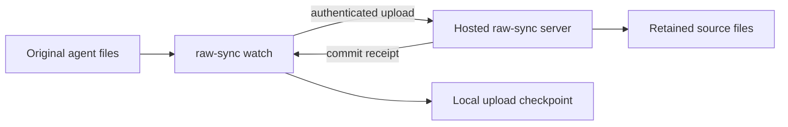

Hosted raw sync uploads original agent session files from your machines to a
server. An operator provides each device's credentials. The client resumes
interrupted uploads and saves its progress across restarts. Run
`agentsview raw-sync watch` to keep the hosted copy current.



The hosted copy retains source files for later processing. Server startup does
not yet run hosted parsing or embedding generation. Use the authenticated status
route to inspect raw custody metadata, or use
[`agentsview pg push`](/docs/pg-sync/) to make sessions browsable on a shared
server.

!!! note "You need provisioned device credentials"

    The laptop command is ready to use once the hosted deployment operator gives you
    a server URL, device ID, and device credential. Device enrollment and revocation
    are operator-managed; AgentsView does not yet provide a public enrollment
    command or HTTP endpoint.

    Use [`agentsview pg push`](/docs/pg-sync/) when the shared server must provide
    browsable sessions today. It parses sessions locally and can build embeddings
    locally before pushing derived rows and vectors to PostgreSQL.

The tracked delivery sequence and production acceptance criteria live in
[GitHub issue #1352](https://github.com/kenn-io/agentsview/issues/1352).

## What is available?

| Layer                  | Status        | Current boundary                                                                                                             |
| ---------------------- | ------------- | ---------------------------------------------------------------------------------------------------------------------------- |
| Raw custody            | Available     | Validated objects, canonical manifests, durable receipts, source-head fencing, and parse-job creation                        |
| Device authentication  | Available     | Credential exchange, scoped short-lived tokens, server-derived identity, and revocation; enrollment remains operator-managed |
| HTTP raw transport     | Available     | Missing-object negotiation, resumable upload, manifest commit, and authenticated status reporting                            |
| Laptop capture         | Available     | Watching, bounded audits, safe SQLite snapshots, durable spooling, checkpoints, retries, and local status                    |
| Server derivation      | Not available | Accepted generations are not yet parsed into PostgreSQL sessions or embeddings                                               |
| Operations and cutover | Not available | Retention, garbage collection, disaster rebuilds, and migration from `pg push` remain future work                            |

### Work still in development

An internal worker library can claim parse jobs, reconstruct their source files,
parse them, and retry failures. `pg serve` does not start this worker. The code
that would save its parsed sessions to PostgreSQL is also unfinished. This
library does not yet provide hosted browsing or embeddings.

The broader delivery issue remains open because public enrollment, hosted
session derivation, and production lifecycle controls are not finished.

## Laptop raw watch daemon

`agentsview raw-sync watch` watches supported local provider roots, captures
their original files, and uploads durable generations. It does not parse
sessions or write the normal local SQLite archive. S3 roots are excluded.

The server URL and device ID may be flags or environment variables. The device
credential is environment-only so it does not appear in process arguments:

```bash
export AGENTSVIEW_RAW_SYNC_URL=https://agents.example.com
export AGENTSVIEW_RAW_SYNC_DEVICE_ID=device-id
export AGENTSVIEW_RAW_SYNC_CREDENTIAL=device-credential
agentsview raw-sync watch
```

The command performs an initial bounded audit, watches for changes, repeats the
audit every 15 minutes by default, and retries uploads every minute. Captures
and upload state are kept under `raw-sync/` in the configured AgentsView data
directory. `agentsview raw-sync status` prints path-free JSON describing the
local checkpoint, pending work, retry time, failures, and coverage.

The normal writable `agentsview serve` daemon has its own parser watcher. Run
both only when local parsed sessions and hosted raw custody are both required;
doing so intentionally creates two watchers over the same provider roots.

## HTTP control plane

`agentsview pg serve` registers the raw-sync routes when its PostgreSQL role can
write every raw-sync table and the ingest-job sequence. A read-only role keeps
serving the normal PostgreSQL-backed UI and API without these runtime routes.
There is no separate raw-sync configuration switch. When requirements are
missing, startup logs `raw-sync routes disabled; missing requirements:` followed
by the exact missing table privileges, sequence access, or read-only transaction
setting.

Upgrading a least-privilege raw-sync role now requires `SELECT` and `UPDATE` on
`raw_ingest_jobs`, in addition to its existing `INSERT` and sequence `USAGE`.
Manifest commits retire the previous source head's pending parse job. As the
schema owner, grant the additional privileges and restart `pg serve`:

```sql
GRANT SELECT, UPDATE ON agentsview.raw_ingest_jobs TO raw_sync_runtime;
```

Replace `agentsview` and `raw_sync_runtime` with your schema and runtime role.
Until these grants are applied, the normal session UI continues to work, but
raw-sync HTTP routes are omitted.

The implemented routes are:

| Route                                   | Authentication                          | Operation                               |
| --------------------------------------- | --------------------------------------- | --------------------------------------- |
| `POST /api/v1/raw-sync/tokens`          | Device credential and device ID         | Issue a 15-minute scoped access token   |
| `GET /api/v1/raw-sync/status`           | Access token with the `status` scope    | Read tenant-scoped raw custody metadata |
| `POST /api/v1/raw-sync/objects/missing` | Access token with the `negotiate` scope | Return object references not in custody |
| `POST /api/v1/raw-sync/uploads`         | Access token with the `upload` scope    | Start or resume an object upload        |
| `HEAD /api/v1/raw-sync/uploads/{id}`    | Access token with the `upload` scope    | Read the accepted upload offset         |
| `PATCH /api/v1/raw-sync/uploads/{id}`   | Access token with the `upload` scope    | Append and finalize object bytes        |
| `POST /api/v1/raw-sync/manifests`       | Access token with the `commit` scope    | Validate and commit one raw generation  |

These machine routes use their own device credentials and scoped tokens. They do
not accept the shared bearer token that can protect the rest of a remote
AgentsView server. The token endpoint accepts the fixed `negotiate`, `upload`,
`commit`, and `status` scope names. To read hosted status, request
`{"scopes":["status"]}` from `POST /api/v1/raw-sync/tokens`, then send the
returned token as `Authorization: Bearer <token>` to
`GET /api/v1/raw-sync/status`.

`GET /api/v1/raw-sync/status` returns five groups for the authenticated tenant:

- `source_heads` lists each device, configured root, provider, source key,
  generation, current manifest acceptance time, and independent parse-pending,
  parse-leased, and parse-failed flags.
- `parse_jobs` counts `ready`, `leased`, `retrying`, `complete`, `failed`, and
  `superseded` parse jobs, including historical generations.
- `active_device_count` and `devices` report unrevoked devices. Each device's
  `last_seen_at` is its latest token issuance, or `null` when it has no token.
- `uploads` reports stored-open upload count, remaining bytes, and the oldest
  open upload. `oldest_open_session` is `null` when no stored-open upload
  exists.

Empty `source_heads` and `devices` values are `[]`. A generation-zero head has a
`null` `last_accepted_at` and false parse flags. Status reads use one read-only
PostgreSQL transaction and do not expire uploads, alter leases, or change any
raw-sync state. `agentsview raw-sync status` remains a local command that reads
the laptop checkpoint.

PostgreSQL stores device, token, manifest, receipt, source-head, and parse-job
metadata. The raw object repository is opened lazily under `raw-sync/` in the
configured AgentsView data directory. The HTTP surface is still an internal
protocol for the AgentsView laptop client, not a supported integration API.

## Raw custody contract

The custody foundation accepts a complete logical generation of one provider
source. A generation is represented by a canonical manifest containing:

- the provider, configured source-root identity, and logical source key;
- a capture identity and capture time;
- either a snapshot with ordered file-object references or a tombstone; and
- the expected receipt for the preceding accepted generation.

The custody API accepts authenticated tenant and immutable device identity
separately from the manifest. The HTTP handlers derive that identity through
device authentication instead of accepting tenant or device fields in request
bodies. Canonicalization binds it into the manifest envelope. The canonical JSON
digest becomes the manifest ID.

Raw objects are identified by exact SHA-256 and byte length. Custody is
tenant-scoped, verifies content before registering it, treats an identical retry
as a no-op, and rejects conflicting content. Providers that AgentsView does not
recognize or excludes from remote sync are rejected before their bytes enter
custody.

A manifest can commit only after every referenced object exists and verifies.
The PostgreSQL acceptance transaction then:

1. checks the expected parent receipt against the current source head;
1. records the manifest, file entries, and ordered object references;
1. assigns a monotonically increasing generation and durable receipt;
1. creates the corresponding parse job; and
1. advances the source head and retires its previous pending parse job.

Repeating the same capture returns its existing receipt. Reusing a capture
identity for different content or committing against a stale parent fails
closed. Accepted manifest metadata is append-only. PostgreSQL holds custody
metadata and processing state; the object store holds the authoritative raw
bytes and canonical manifests.

## Device authentication contract

Enrollment creates an immutable device ID and a random credential. The clear
credential is returned once; PostgreSQL retains only its SHA-256 digest.

An active device exchanges that credential for an opaque, short-lived token.
Tokens can be restricted to one or more fixed operations:

- missing-object negotiation;
- object upload;
- manifest commit; and
- status reads.

Token authentication derives the tenant and device from server-side records and
checks the required scope and expiry. PostgreSQL stores only the token digest.
Revoking a device prevents new token issuance and immediately makes its
outstanding tokens unusable. A human-readable device name is display metadata,
not authorization identity.

## Security and deployment boundary

Raw provider files can contain prompts, responses, tool activity, paths, and
other sensitive data. Hosted raw sync is not end-to-end encrypted: the server
must be able to read retained source files to parse them.

The implemented foundations isolate object and metadata identities by tenant and
do not deduplicate across tenants. A production deployment must also provide TLS
in transit, encryption at rest for object storage, PostgreSQL, backups, and
worker scratch space, plus access controls around device enrollment and
revocation. PostgreSQL row-level security remains a planned defense-in-depth
layer; the current foundation does not configure it.

Treat the HTTP routes as the protocol between the bundled laptop client and a
hosted AgentsView deployment, not as a general integration API. Public operator
controls, compatibility policy, and recovery tooling will be documented when
those entry points exist.
