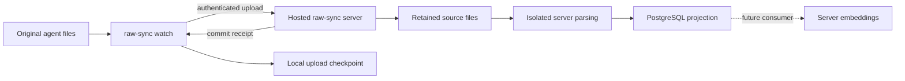

Hosted raw sync uploads original agent session files from your machines to a
server. An operator provides each device's credentials. The client resumes
interrupted uploads and saves its progress across restarts. Run
`agentsview raw-sync watch` to keep the hosted copy current.


```mermaid
flowchart LR
    Files["Original agent files"] --> Client["raw-sync watch"]
    Client -->|"authenticated upload"| Server["Hosted raw-sync server"]
    Server --> Storage["Retained source files"]
    Server -->|"commit receipt"| Client
    Client --> Checkpoint["Local upload checkpoint"]
    Storage --> Parser["Isolated server parsing"]
    Parser --> PostgreSQL["PostgreSQL projection"]
    PostgreSQL -. "future consumer" .-> Embeddings["Server embeddings"]
```

The server can now parse accepted generations directly into PostgreSQL. Enable
`raw_derivation` on an explicitly provisioned hosted tenant to make uploaded
sessions browsable. Hosted processing uses no SQLite archive intermediary;
SQLite databases captured from providers remain valid source artifacts.
Embedding work is durably queued, but its consumer is not implemented.

Device enrollment and revocation remain operator-managed. The operator supplies
each laptop with a server URL, device ID and credential. There is no public
enrollment command or HTTP endpoint. The broader delivery work remains tracked
in [issue #1352](https://github.com/kenn-io/agentsview/issues/1352), including
embedding consumption, accepted-generation retention and garbage collection, and
disaster rebuilds.

## Provision a hosted instance

Use one PostgreSQL schema, restricted runtime role and server instance per
tenant. Requests cannot select arbitrary tenants. The schema is permanently
bound to its tenant; runtime connections check the binding, forced row-level
security, constraints, indexes and protected catalog before serving or leasing
work. Provisioning and upgrades require a separate schema-owner connection.

Configure an owner target and a runtime target in the operator's protected
configuration. Supply actual connection URLs and a generated cursor secret
through your secret manager or protected config file. The values below are
placeholders, not environment-variable interpolation. Use the same tenant and
schema for both targets, and make the runtime target the effective default:

```toml
default_pg = "hosted"
require_auth = true
cursor_secret = "REPLACE_WITH_BASE64_RANDOM_SECRET"

[pg.provision]
url = "postgres://hosted_owner@db.example.com/agentsview?sslmode=require"
schema = "hosted_sessions"
raw_tenant = "tenant-example"

[pg.hosted]
url = "postgres://hosted_runtime@db.example.com/agentsview?sslmode=require"
schema = "hosted_sessions"
raw_tenant = "tenant-example"
raw_derivation = true
raw_poll_seconds = 5
raw_attempt_seconds = 60
raw_max_attempts = 5
```

`cursor_secret` is a stable base64-encoded secret shared by restarts of this
instance. Keep authentication enabled even on loopback. Supply TLS through your
reverse proxy and configure the exact public origin as for ordinary remote
access. The shared server bearer token protects viewer APIs; device credentials
and scoped tokens separately protect raw-sync routes.

Run explicit provisioning with the owner target:

```bash
agentsview pg hosted-provision provision
```

This command installs or upgrades hosted tables and protections. It does not
create login roles or grant runtime access. Existing derived rows are retained;
existing raw rows must already belong to the chosen tenant. Unknown relations,
unmanaged vector layouts and conflicting ownership can block adoption. Plan
imports and schema upgrades during an operator-controlled maintenance window.
Runtime startup never migrates or provisions the hosted schema.

Create a separate login role with
`NOSUPERUSER NOBYPASSRLS NOCREATEDB NOCREATEROLE NOREPLICATION NOINHERIT`,
provision its credential through your normal PostgreSQL administration process,
and grant it `CONNECT` to the database. It must own no application objects, have
no role memberships, database or schema `CREATE`, sibling-schema data access, or
callable application `SECURITY DEFINER` functions. Remove inherited `PUBLIC`
grants where necessary, including `CREATE` on the public schema on older
PostgreSQL installations. Do not grant `TRUNCATE`, `TRIGGER` or `REFERENCES` on
hosted tables.

For a newly provisioned schema, the following grants cover full and transcript
content, custody, publication, bounded reparse and supported curation. Replace
`hosted_sessions` and `hosted_runtime` with your schema and restricted role. Run
this as the owner before starting the runtime:

```sql
GRANT USAGE ON SCHEMA hosted_sessions TO hosted_runtime;
GRANT SELECT ON ALL TABLES IN SCHEMA hosted_sessions TO hosted_runtime;

GRANT INSERT ON hosted_sessions.raw_device_tokens,
  hosted_sessions.raw_manifest_entries, hosted_sessions.raw_manifest_objects,
  hosted_sessions.messages, hosted_sessions.tool_calls,
  hosted_sessions.tool_result_events, hosted_sessions.usage_events,
  hosted_sessions.secret_findings, hosted_sessions.excluded_sessions,
  hosted_sessions.raw_projection_generations,
  hosted_sessions.raw_source_contributions,
  hosted_sessions.raw_session_public_aliases,
  hosted_sessions.raw_embedding_outbox TO hosted_runtime;

GRANT INSERT, UPDATE ON hosted_sessions.raw_objects,
  hosted_sessions.raw_source_heads, hosted_sessions.raw_ingest_jobs,
  hosted_sessions.raw_source_projections, hosted_sessions.raw_session_groups,
  hosted_sessions.raw_content_revisions, hosted_sessions.raw_session_branches,
  hosted_sessions.raw_corpus_state, hosted_sessions.raw_projection_rollouts
  TO hosted_runtime;
GRANT INSERT ON hosted_sessions.raw_manifests TO hosted_runtime;

GRANT INSERT, UPDATE, DELETE ON hosted_sessions.raw_upload_sessions,
  hosted_sessions.sessions, hosted_sessions.session_sources,
  hosted_sessions.pinned_messages, hosted_sessions.raw_curation,
  hosted_sessions.raw_pins TO hosted_runtime;
GRANT INSERT, DELETE ON hosted_sessions.starred_sessions,
  hosted_sessions.raw_session_links TO hosted_runtime;

GRANT USAGE ON SEQUENCE hosted_sessions.raw_ingest_jobs_id_seq,
  hosted_sessions.tool_calls_id_seq, hosted_sessions.tool_result_events_id_seq,
  hosted_sessions.usage_events_id_seq, hosted_sessions.pinned_messages_id_seq
  TO hosted_runtime;
```

Sequence names above are those created by provisioning. For an adopted schema,
resolve the actual owned sequence with `pg_get_serial_sequence`; serial IDs need
`USAGE` or `UPDATE`, while identity-generated IDs need no separate sequence
grant. Enrollment needs an operator credential with device-write privileges; the
runtime grants intentionally omit those privileges.

`archive_content = "usage"` also requires `SELECT` on `vector_generations` and
`SELECT, DELETE` on existing `vector_documents`, `vector_push_state` and each
existing `vector_chunks_g<ID>` table named by a generation. This removes any
previously retained indexed content. It does not create or consume embeddings.
The runtime checks the configured policy's grants before readiness and reports
missing privileges instead of silently disabling hosted processing.

Start the effective default target:

```bash
agentsview pg serve --no-browser
```

Named targets retain their ordinary selection rules. A single-target deployment
can put the same hosted keys under `[pg]`. `AGENTSVIEW_PG_URL` and
`AGENTSVIEW_PG_SCHEMA` override only the effective default target. They do not
rewrite the separate named owner target. `pg push` refuses a hosted-owned schema
before mutation, even if the client omits its hosted configuration fields. Use a
separate legacy schema for local pushes.

## Isolation and processing limits

Hosted parser activation requires Linux amd64 or arm64, a cgo-enabled build,
user/mount/network namespaces, `close_range`, and seccomp with thread
synchronization. Startup tests actual source visibility inside the sandbox
before claiming a job. Unsupported kernels, containers, non-Linux hosts and
Linux builds without cgo fail closed. There is no in-process parser fallback.
The positive kernel suite has been executed on amd64; arm64 has compile proof
but still needs an execution gate on that architecture.

Each parser child gets only bounded protocol pipes and a minimal environment. A
pre-runtime constructor closes inherited descriptors above stderr before Go
initializes. The child sees a read-only source mount inside an otherwise empty,
read-only jail. Filesystem escape, networking and process creation are denied;
seccomp applies to every existing thread and allows only constrained runtime
thread creation. No external sandbox helper is required.

| Limit                                        | Value                                           |
| -------------------------------------------- | ----------------------------------------------- |
| Worker concurrency                           | One sequential job per instance                 |
| Poll interval                                | Default 5 seconds; maximum 60                   |
| Whole attempt wall time                      | Default 60 seconds; maximum 300                 |
| Attempts per selected generation             | Default 5; maximum 10                           |
| Retry backoff                                | Exponential from 1 second, capped at 60 seconds |
| Lease / heartbeat                            | 60 seconds / 10 seconds                         |
| Materialized source bytes                    | 512 MiB                                         |
| Parser stdout / stderr                       | 32 MiB / 64 KiB                                 |
| Child address space / data                   | 2 GiB / 512 MiB                                 |
| Child CPU / open descriptors                 | 30 seconds / 64                                 |
| Manifest bytes / entries / object references | 1 MiB / 4,096 / 16,384                          |

Custody may accept files larger than the materialization limit. Such captures
remain retained but cannot be projected by this worker. Accepted source bytes
are untrusted, even after device authentication. Publication atomically writes
normalized rows, source proof, identity changes, curation and job outcome under
the selected generation and lease fence. Partial results retain older proof for
unresolved members and retry finitely. Exhausted jobs remain failed until new
source or processing-version selection provides new work.

Equivalent content from several devices coalesces when it shares a stable
provider session identity. Piebald's numeric database IDs stay scoped to their
source, so unrelated chats on different devices do not merge. Without a stable
provider identity, sources remain separate even when their content matches.

A shorter transcript shares the longer copy's displayed session when every
retained message and usage event matches its prefix and the source metadata
agrees. Each source keeps its captured revision. When a later snapshot of the
longer source no longer contains the session, the shorter copy is displayed
again. Changed messages, conflicting metadata, or several divergent
continuations remain separate variants; the bare session ID is then ambiguous.
Such a removal retracts only that source's proof.

A source file that disappears from its device does not remove its sessions.
`raw-sync watch` reports the disappearance as a tombstone, and the server
records it as the source's current generation. The sessions that source last
supplied stay listed and searchable with their names, stars, pins, and source
proof. If the file returns, its new snapshot updates the same sessions. Only
three things remove a hosted session: the user deletes it, the parser excludes
it, or a later snapshot of a source that reports its full contents omits it.

A departed source sends no further snapshot. If its copy of a session conflicts
with another device's, the two stay separate variants and the bare session ID
stays ambiguous. Deleting the departed variant resolves it.

A departed source has nothing left to parse, so `pg raw-reparse` leaves its
retained sessions as the earlier parser produced them. Sessions hidden by a
tombstone that was processed before this rule took effect stay hidden until
their source returns; their raw files and manifests remain in custody.

Names, stars and pins survive compatible publication; ambiguous identity never
silently picks a transcript. Owner imports that change legacy identity must
retry their transaction on serialization failure (`SQLSTATE 40001`) if
publication or curation holds a conflicting identity lock. Ordinary legacy
content and curation writes do not take those identity locks.

Selecting a parser job does not expire browsing cursors. Publishing changed
identities does; the sidebar and activity report reload when their next page
uses an expired cursor. The API returns a bad-request response for invalid or
expired cursors.

Hosted raw derivation accepts `tool_result_images = "keep"` or `"drop"`. It
rejects `"offload"` at startup because it has no hosted image asset store. This
restriction does not prevent serving existing hosted sessions with
`raw_derivation = false`.

The maintenance pass examines at most 64 indexed pending signal rows with a
10-second timeout. It does not scan the archive during idle polling. Shutdown
cancels and joins worker, materializer and parser work before closing custody
and PostgreSQL.

## Reparse and rollback

After an executable upgrade changes the parser data version, schedule current
heads explicitly in bounded batches:

```bash
agentsview pg raw-reparse hosted --run-id parser-rollout-1 --batch-size 64
```

Repeat the same run ID until the command output contains `complete=true`. A call
selects at most 1–256 heads and atomically saves its keyset checkpoint. The run
ID is bound to the executable's processing version. Equal manifest/version
selection is idempotent: a new run ID does not resurrect completed or exhausted
jobs for that same selection. Startup and idle polls perform no reparse scan.

A source whose file has left its device has a tombstone as its current head.
Reparsing it changes nothing, so its retained sessions keep the output of the
parser that last read the file.

To stop derivation, set `raw_derivation = false` and restart. Keep `raw_tenant`,
authentication, the cursor secret and the tenant-bound runtime connection.
Hosted public reads and raw custody remain available; accepted new manifests
still select their current processing version. Removing `raw_tenant` from an
owned schema fails rather than exposing physical storage identities. This
rollback does not convert the schema back to a `pg push` destination.

Keep PostgreSQL metadata and the immutable raw repository together in backups.
Automated retention and garbage collection of accepted generations, disaster
rebuilds, enrollment UX, embedding consumption and migration cutover tooling
remain outside this release.

## Backfill existing laptop sources

Run a finite backfill before starting the watcher on a laptop that already has
session history. The command reads the same configured filesystem roots as local
sync. It captures and uploads original provider files without opening, parsing,
or changing the local SQLite archive. S3 roots are not accepted.

Use a stable run ID and select every provider included in this migration:

```bash
export AGENTSVIEW_RAW_SYNC_URL=https://agents.example.com
export AGENTSVIEW_RAW_SYNC_DEVICE_ID=device-id
export AGENTSVIEW_RAW_SYNC_CREDENTIAL=device-credential

agentsview raw-sync backfill \
  --run-id laptop-history-1 \
  --provider claude \
  --provider codex \
  --batch-size 128 \
  --format json
```

Batch size may be 1–512 and can change between attempts. The run ID is bound to
the device, server, selected providers, and the root entries as written in the
configuration. Reordered or duplicate provider flags describe the same
selection. A changed device, provider set, root entry, or root order needs a new
run ID, because the order in the configuration decides which root owns a file
that two overlapping roots both contain.

The checkpoint is bound to one server URL, including any path prefix, for both
backfill and watch. For example, `https://agents.example.com/team-a` and
`https://agents.example.com/team-b` are separate destinations. A new run ID does
not permit a different destination to reuse its receipts. To use another server,
choose a separate `AGENTSVIEW_DATA_DIR` and enroll a device there. An older
checkpoint with uploads but no recorded server also requires a separate data
directory and a newly enrolled device; the client cannot establish where those
uploads went. The original checkpoint and local archive remain intact.

A run starts only when every configured root of the selected providers exists.
If one is missing, such as a stale entry or an unmounted drive, the command
exits with status 1 before saving the run. Mount the root or remove it from the
configuration, then run the command again. A new Crush run also rejects an
existing `projects.json` that cannot be read or decoded; repair the registry
before retrying. A started run keeps the roots it resolved on its first attempt,
so captured work still uploads after a source root is unmounted. It also saves
Crush's registry-derived project paths, so later registry changes, including a
broken registry, do not alter the attribution of resumed uploads.

Each invocation is finite. It does not sleep until a failed or deferred upload
becomes eligible. An incomplete attempt prints current aggregate progress and
exits with status 2; repair the unavailable root, local spool capacity, device
authorization, network, or server rejection, then run the same command again.

Two failures end a run for good. Repeating the run can't finish it, so start a
new run ID, which captures the affected source again:

- `rejected`: the server permanently refused a capture in the run. Fix the
  source first.
- `capture_lost`: a capture was removed from the local spool before it uploaded,
  for example by checkpoint recovery after a missing object.

JSON output is one object with `captured`, `acknowledged`, `pending`, failure
counters, and an explicit `complete` field. Human output states `complete` or
`incomplete` directly. Output and errors do not include source paths, transcript
content, credentials, receipts, or raw server responses.

When the same immutable run reports `"complete":true`, its saved result is
historical proof. Repeating it does not rediscover sources, contact the server,
or create another generation, even if files were appended or the old root is no
longer mounted. Start the watcher after that result to capture later changes:

```bash
agentsview raw-sync watch
```

Keep the same device ID, credential, server, and provider configuration for the
handoff. The watcher owns the same checkpoint writer and continues from the
acknowledged source heads left by the backfill, so do not run both commands at
the same time.

## Laptop raw watch daemon

`agentsview raw-sync watch` watches supported local provider roots, captures
their original files, and uploads durable generations. It does not parse
sessions or write the normal local SQLite archive. S3 roots are excluded.

The server URL and device ID may be flags or environment variables. The device
credential is environment-only so it does not appear in process arguments:

```bash
export AGENTSVIEW_RAW_SYNC_URL=https://agents.example.com
export AGENTSVIEW_RAW_SYNC_DEVICE_ID=device-id
export AGENTSVIEW_RAW_SYNC_CREDENTIAL=device-credential
agentsview raw-sync watch
```

To read hosted status without starting the watcher, run:

```bash
agentsview raw-sync server-status
```

`raw-sync watch` performs an initial bounded audit, watches for changes, repeats
the audit every 15 minutes by default, and retries uploads every minute.
Captures and upload state are kept under `raw-sync/` in the configured
AgentsView data directory. `agentsview raw-sync status` prints path-free JSON
describing the local checkpoint, pending work, retry time, failures, and
coverage.

When a complete audit finds that a previously captured file is gone, the
watcher uploads a tombstone for it. The server keeps the sessions already
derived from that file; see
[Isolation and processing limits](#isolation-and-processing-limits).

The normal writable `agentsview serve` daemon has its own parser watcher. Run
both only when local parsed sessions and hosted raw custody are both required;
doing so intentionally creates two watchers over the same provider roots.

## Upload maintenance

When raw-sync routes are active, `agentsview pg serve` cleans upload sessions
and the private `raw-upload-spool` directory during startup and every 15
minutes. It expires due open sessions, removes due terminal sessions, and
reconciles orphaned `.part` files through the existing PostgreSQL upload store.
Each pass uses the existing bound of up to 128 rows per SQL batch and 128 spool
entries per directory scan. The server keeps its spool cursor between passes.

Run the same bounded pass on demand with:

```bash
agentsview raw-sync clean-uploads
```

The command uses the effective PostgreSQL target and data directory paired with
`pg serve`, so an operator can run it while the server is stopped or when
cleanup should happen immediately. A short-lived command starts a fresh spool
cursor, so each invocation inspects at most the first 128 entries returned by
the spool directory. Repeating the command can revisit the same preserved
entries. Entries beyond that window require the running server, which keeps its
cursor between passes. The command checks that the target has the provisioned
raw-sync schema and write privileges before creating the upload spool. It
reports `Raw upload cleanup pass completed.` only after the cleanup store closes
successfully.

## HTTP control plane

In legacy mode, `agentsview pg serve` registers raw-sync routes when its
PostgreSQL role has the required custody-table and ingest-job sequence grants. A
read-only role keeps serving the PostgreSQL UI and API without these routes.
Explicit hosted mode uses `raw_tenant` and requires the full hosted preflight;
`raw_derivation` controls its worker. When legacy route requirements are
missing, startup logs `raw-sync routes disabled; missing requirements:` followed
by the exact missing table privileges, sequence access, or read-only transaction
setting.

Upgrading a least-privilege raw-sync role now requires `SELECT` and `UPDATE` on
`raw_ingest_jobs`, in addition to its existing `INSERT` and sequence `USAGE`.
Manifest commits retire the previous source head's pending parse job. As the
schema owner, grant the additional privileges and restart `pg serve`:

```sql
GRANT SELECT, UPDATE ON agentsview.raw_ingest_jobs TO raw_sync_runtime;
```

Replace `agentsview` and `raw_sync_runtime` with your schema and runtime role.
Until these grants are applied, the normal session UI continues to work, but
raw-sync HTTP routes are omitted.

The health read uses `SELECT` on the raw-sync metadata tables and adds no
privilege beyond the grants above.

The implemented routes are:

| Route                                   | Authentication                          | Operation                               |
| --------------------------------------- | --------------------------------------- | --------------------------------------- |
| `POST /api/v1/raw-sync/tokens`          | Device credential and device ID         | Issue a 15-minute scoped access token   |
| `GET /api/v1/raw-sync/status`           | Access token with the `status` scope    | Read tenant-scoped raw custody metadata |
| `GET /api/v1/raw-sync/health`           | Access token with the `status` scope    | Report tenant-scoped parse-job health   |
| `POST /api/v1/raw-sync/objects/missing` | Access token with the `negotiate` scope | Return object references not in custody |
| `POST /api/v1/raw-sync/uploads`         | Access token with the `upload` scope    | Start or resume an object upload        |
| `HEAD /api/v1/raw-sync/uploads/{id}`    | Access token with the `upload` scope    | Read the accepted upload offset         |
| `PATCH /api/v1/raw-sync/uploads/{id}`   | Access token with the `upload` scope    | Append and finalize object bytes        |
| `POST /api/v1/raw-sync/manifests`       | Access token with the `commit` scope    | Validate and commit one raw generation  |

These machine routes use their own device credentials and scoped tokens. They do
not accept the shared bearer token that can protect the rest of a remote
AgentsView server. The token endpoint accepts the fixed `negotiate`, `upload`,
`commit`, and `status` scope names. To read hosted status, request
`{"scopes":["status"]}` from `POST /api/v1/raw-sync/tokens`, then send the
returned token as `Authorization: Bearer <token>` to
`GET /api/v1/raw-sync/status`.

`GET /api/v1/raw-sync/status` returns five groups for the authenticated tenant:

- `source_heads` lists each device, configured root, provider, source key,
  generation, current manifest acceptance time, and independent parse-pending,
  parse-leased, and parse-failed flags. `last_parse_completed_at` is the
  latest `updated_at` of a completed parse job for the current manifest,
  across processing versions. It is `null` for generation-zero heads or when
  no current parse job has completed.
- `parse_jobs` counts `ready`, `leased`, `retrying`, `complete`, `failed`, and
  `superseded` parse jobs, including historical generations.
- `active_device_count` and `devices` report unrevoked devices. Each device's
  `last_seen_at` is its latest token issuance, or `null` when it has no token.
- `uploads` reports stored-open upload count, remaining bytes, and the oldest
  open upload. `oldest_open_session` is `null` when no stored-open upload
  exists.

Empty `source_heads` and `devices` values are `[]`. A generation-zero head has a
`null` `last_accepted_at` and false parse flags. Status reads use one read-only
PostgreSQL transaction and do not expire uploads, alter leases, or change any
raw-sync state. `agentsview raw-sync server-status` adds `pipeline_depth`, the
sum of `ready`, `leased`, and `retrying` parse jobs, including jobs from
historical generations that the server has not yet superseded. It also adds
`last_parse_latency_seconds`, the time from manifest acceptance to completion
for the most recently completed current head. It includes time waiting to parse
and is `null` when no current head has both timestamps. It does not measure the
age of pending work or increase when parsing stalls. A new generation replaces
its head's previous completion. If the same manifest is parsed again under a new
processing version, the interval still starts at its original acceptance.
`last_parse_completed_at` and `last_parse_latency_seconds` stay `null` until
hosted parsing records completions, while `pipeline_depth` remains the numeric
sum.

`agentsview raw-sync status` reads the laptop checkpoint. `server-status`
reports HTTP 404 as an error and directs the operator to that local command.
Request failures include their underlying cause; HTTP errors also include the
server's error code and message when available.

A status-scoped token can call the health route with positive `max_attempts` and
`stale_after_seconds` query values. The report covers current accepted manifests
without parse jobs, expired leased parse jobs, failed parse jobs grouped by
their stored error class, and retrying jobs at or above
`greatest(1, max_attempts - 1)`. These counts include only current source heads
and selected processing versions, so replacing a manifest or parser version
clears obsolete job warnings.

`stale_source_heads` reports parse lag: current manifests accepted at least
`stale_after_seconds` ago with no completed parse job for a selected processing
version. It includes pending tombstones but excludes successfully parsed idle
sessions. Rows expose `accepted_at`, the time used for this threshold. All
response timestamps use UTC.

Each affected-row list holds at most 50 rows, failure classes hold at most 20
rows, and totals stay exact. The read is tenant-wide, excludes raw error
messages, and leaves custody and worker state unchanged. The local status
command still reads the laptop checkpoint.

PostgreSQL stores device, token, manifest, receipt, source-head, and parse-job
metadata. The raw object repository is opened lazily under `raw-sync/` in the
configured AgentsView data directory. The HTTP surface is still an internal
protocol for the AgentsView laptop client, not a supported integration API.

## Raw custody contract

The custody foundation accepts a complete logical generation of one provider
source. A generation is represented by a canonical manifest containing:

- the provider, configured source-root identity, and logical source key;
- a capture identity and capture time;
- either a snapshot with ordered file-object references or a tombstone; and
- the expected receipt for the preceding accepted generation.

The custody API accepts authenticated tenant and immutable device identity
separately from the manifest. The HTTP handlers derive that identity through
device authentication instead of accepting tenant or device fields in request
bodies. Canonicalization binds it into the manifest envelope. The canonical JSON
digest becomes the manifest ID.

Raw objects are identified by exact SHA-256 and byte length. Custody is
tenant-scoped, verifies content before registering it, treats an identical retry
as a no-op, and rejects conflicting content. Providers that AgentsView does not
recognize or excludes from remote sync are rejected before their bytes enter
custody.

A manifest can commit only after every referenced object exists and verifies.
The PostgreSQL acceptance transaction then:

1. checks the expected parent receipt against the current source head;
1. records the manifest, file entries, and ordered object references;
1. assigns a monotonically increasing generation and durable receipt;
1. creates the corresponding parse job; and
1. advances the source head and retires its previous pending parse job.

Repeating the same capture returns its existing receipt. Reusing a capture
identity for different content or committing against a stale parent fails
closed. Accepted manifest metadata is append-only. PostgreSQL holds custody
metadata and processing state; the object store holds the authoritative raw
bytes and canonical manifests.

## Device authentication contract

Enrollment creates an immutable device ID and a random credential. The clear
credential is returned once; PostgreSQL retains only its SHA-256 digest.

An active device exchanges that credential for an opaque, short-lived token.
Tokens can be restricted to one or more fixed operations:

- missing-object negotiation;
- object upload;
- manifest commit; and
- status reads.

Token authentication derives the tenant and device from server-side records and
checks the required scope and expiry. PostgreSQL stores only the token digest.
Revoking a device prevents new token issuance and immediately makes its
outstanding tokens unusable. A human-readable device name is display metadata,
not authorization identity.

## Security and deployment boundary

Raw provider files can contain prompts, responses, tool activity, paths, and
other sensitive data. Hosted raw sync is not end-to-end encrypted: the server
must be able to read retained source files to parse them.

The implemented foundations isolate object and metadata identities by tenant and
do not deduplicate across tenants. A production deployment must also provide TLS
in transit, encryption at rest for object storage, PostgreSQL, backups, and
worker scratch space, plus access controls around device enrollment and
revocation. Explicit hosted provisioning installs forced PostgreSQL row-level
security, tenant constraints and schema binding; runtime validation rejects
weakened protections. This is one tenant per instance, not request-multiplexed
tenancy.

Treat the HTTP routes as the protocol between the bundled laptop client and a
hosted AgentsView deployment, not as a general integration API. Enrollment and
lifecycle controls remain operator-managed; the provisioning and bounded reparse
commands above are the implemented operator entry points.

Explicit parent and tool-subagent links first use their own source's historical
proof. Removed or excluded same-source proof prevents fallback. When no such
proof exists, a link may resolve across files only within the same tenant,
device, provider, and configured root, and only to one eligible content cohort.
Conflicting candidates remain unresolved. Fresh session, timing, and sidebar
reads use this rule. A target-only graph change does not necessarily notify an
unchanged owner's session stream; graph-only live refresh is not guaranteed.
